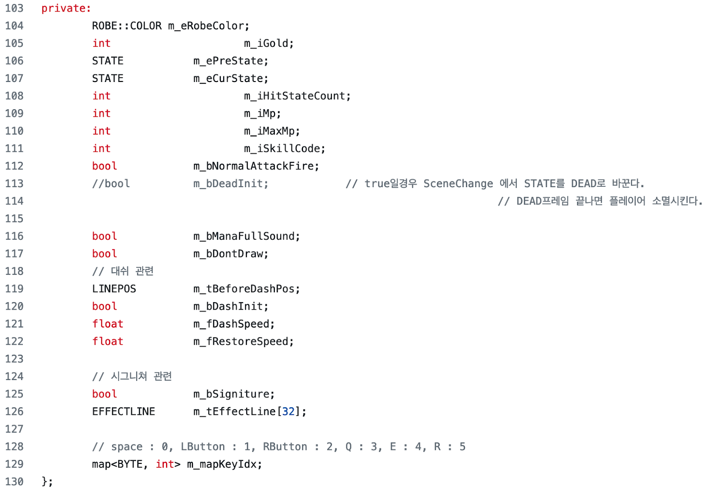

# Clean Code Study - Week1
#### 2023-01-05. Fri. written by HT.LEE
- - -

## Ch1. Clean Code   
* 소개
    + 코딩하는 것을 다른 행동에 비유해보자.
        - 입시 미술 정물화 그리기 (객관적 평가기준이 있음)
        - 자동차 운전하기
        - 논설문을 작성하기
        - 정원 가꾸기

* 코드가 있으리라 (There will be code)
    + Question: 저자는 ‘코드가 작성되는 대신 (자동으로) 생성될 것이다.’라는 말에 반박한다. 현재 GPT-3 기술이 공개된 시점에서, 아직도 이 반박은 유효한가? 정말 코드는 먼 미래에도 인간이 작성해야하는가?
        - 내 의견: 인간이 작성해야한다고 봄. 너무나도 다양한 종류의 문제(고객의 요구)가 있기 때문.
    + <i>"We will never be rid of code, because code represents the details of the requirements."</i>

* 나쁜 코드
    + 80년대 킬러 앱 사례
    + 코드는 시간이 지날 수록 녹슨다. 정원에 벌레가 생기고 잡초가 자라듯
    + Later equals never

* 지저분한 것을 안고 가는 비용 (The total cost of owning a mess)
    + (코드의) 쓰레기가 생성될 때마다, 팀의 생산성은 0에 한 없이 가까워질 때까지 감소한다.
    + Attitude - 개발자가 지녀야할 태도, (특히, 매니저와의 관계와 관련해서)
    + 마감을 지키는 유일한, 그리고 빠르게 일을 진행할 유일한 방법은 오직 항상 코드를 최대한 깨끗하게 유지하는 것
    + Bjarne - I like my code to be “elegant” and “efficient”
    + Grady Booch - simple, direct, reads like well-written prose. “Full of crisp abstraction”
    + Dave Thomas - “minimal”, “literate”
    + Michael Feathers - “care”
    + Ron Jeffries - simple code를 위한 조건들 제시
    + 첨언 - Dijkstra는 “Simplicity is prerequisite for reliability.” 라 강조
    + Ward Cunningham - 남이 내 코드를 읽었을 때 당황스러움이 없어야 함.

* 생각 학교
    + 무술 도장 비유
    + 우리는 저자(Authors)다
        - Emacs
        - Reading : Writing = 10 : 1

* 보이스카웃 원칙
    + 입실할 때보다 더 깨끗하게 치운 후에 퇴실하세요.
    + 클린업이 뭐 거창한걸 얘기하는 건 아님
        - 변수 명 개선, 모듈화, 중복 제거 등

* 프리퀄과 원칙(Prequel and Principles)
    + [클린 코드]는 Agile Software Development(2002)의 프리퀄임.
    + Agile…에서 언급한 원칙들 얘기할 거
        - Single Responsibility Principle
        - Open Closed Principle
        - Dependency Inversion Principle
* 결론
    + 그저 책 읽는다고 유능한 프로그래머 되는 거 아니니 연습, 연습, 연습해라

- - -
## Ch2. Meaningful Names
+ 소개   
    - 좋은 이름 짓는 것은 쉽지 않음에도, 반드시 시간 들여서 잘 해야 한다.
    - Why? - 가독성
  
+ 의도를 드러내는 이름을 써라   
    - int d; -> int elapsedTimeInDays;
    - Why? : 명료성을 위해

+ 가짜정보(disinformation)을 피해라
    - accounts 그룹을 accountList라고 이름 짓지 마라.
        * 설령 실제 컨테이너가 list라 할지라도 그렇게 하지 마라!
    - XYZControllerForEfficientHandlingOfStrings   
    XYZControllerForEfficientStorageOfStrings

+ 의미있는 구분을 만들도록 해라
    - a1, a2, … aN
    - Product, ProductInfo, ProductData
    - Name , NameString
    - Customer ,  CustomerObject   

+ 발음할 수 있는 이름을 써라
    - genymdhms

+ 검색할 수 있는 이름을 써라
    - 다른 말로, 리터럴 상수 그대로 쓰지 말고 (이름 있는) 변수를 써라.

+ 인코딩 피해라
    - 헝가리안 표기법 - 불필요한 접두사에 불과
    - https://learn.microsoft.com/en-us/windows/win32/stg/coding-style-conventions  
    
    - </img> 

+ 두뇌를 쓰는 매핑을 피해라(Avoid mental mapping)
    - <i>"Clarity is king"</i>

+ 클래스 명 작성 요령
    - 동사로 쓰지 말고 명사로 써라.

+ 메소드 명 작성 요령
    - 동사 또는 동사구로 써라.
    -   직접 생성자 쓰지 말고 인자를 묘사할 수 있는 이름을 가지는 static factory methods를 써라. -> Effective Java에서도 똑같은 말 함.

+ Don’t be cute
    - HolyHandGrenade (x)
    - 뜻 하는 바를 말하고, 말한 바를 뜻하게 해라.

+ 한 개념 당 한 단어
    - 툴에서 매개변수, 주석 등 안 알려주더라도 함수명만으로 그 함수가 무슨 역할을 하는지 설명할 수 있도록 이름 지어야 함.

+ 말 장난치지 마라 (Don’t pun)
    - add는 add역할을 해야함. (약속, 관행을 따라라)

+ 솔루션 도메인 이름을 사용해라
    - 용어들 활용해라
        * CS 용어, 알고리즘 이름, 패턴 이름, 수학 용어 등

+ 문제 도메인 이름을 사용해라
    - 해당 도메인의 전문가에게 물어봐라.
        * ex) 항공기 예약 앱 -> 항공사, 멘트케어서비스 -> 정신과의사

+ 의미있는 문맥 사용해라
    - state 단독
    - firstName, lastName, street, houseNumber, city, state, zipcode
    - Listing 2-1

+ 불필요한 문맥 덧붙이지 마라
    - MAC, URI…

+ 결론
    - 문화적 배경을 공유하면서도 설명력 갖춘 이름을 짓는 것은 쉬운 일 아님.
    - 네이밍센스는 교육적 문제임
    - 네이밍 룰 적용하면서 코드 가독성이 향상되는지 체크해봐라.

+ Ch2. 후기
내가 초보 프로그래머 때부터 경험적으로 했던 모든 잘못된 것들이 다 담겨있음
컨테이너 타입 명시 안하는 게 대부분의 경우 좋다는 것을 알게 되었음.
좋은 네이밍 센스는 다른 사람을 배려하는 문화!

- - -
* 심화 학습