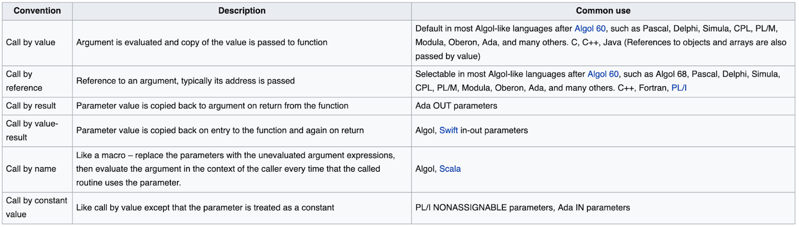
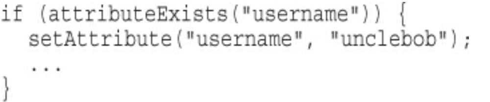
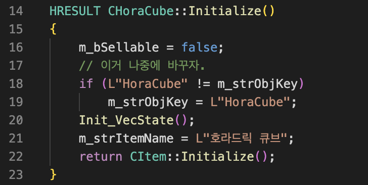
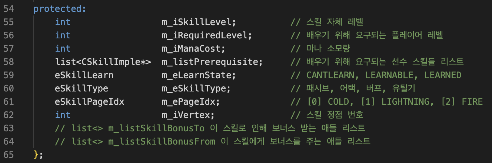
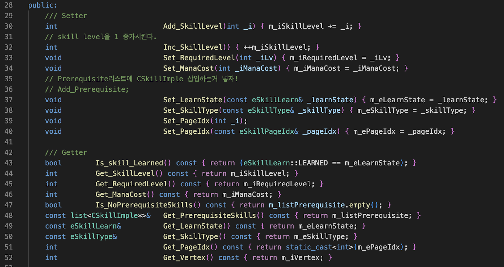
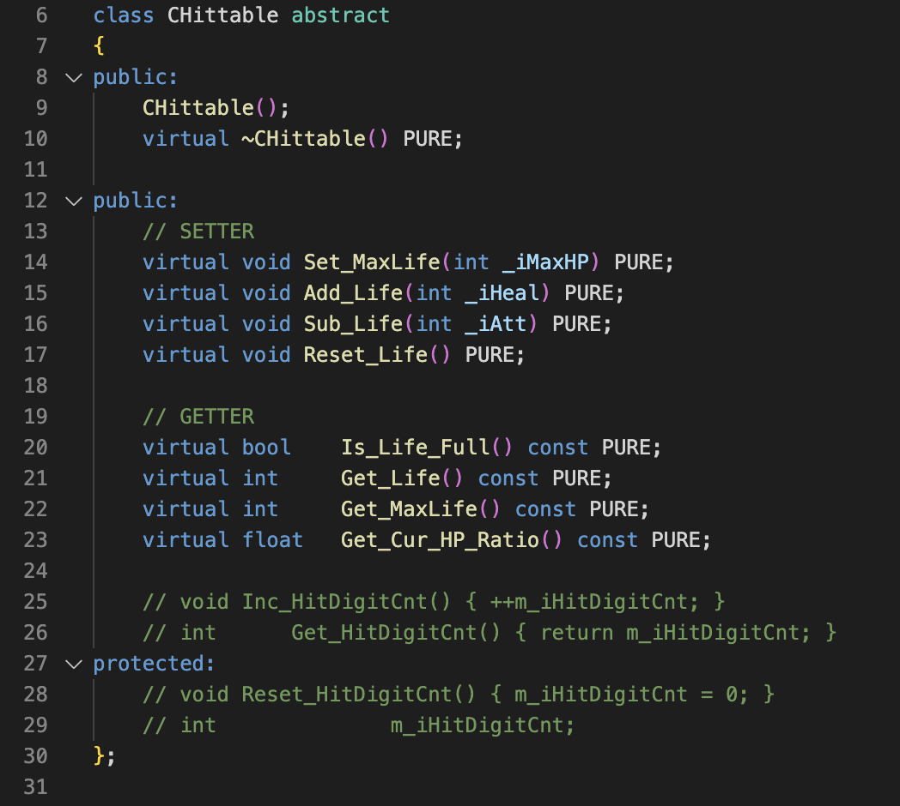
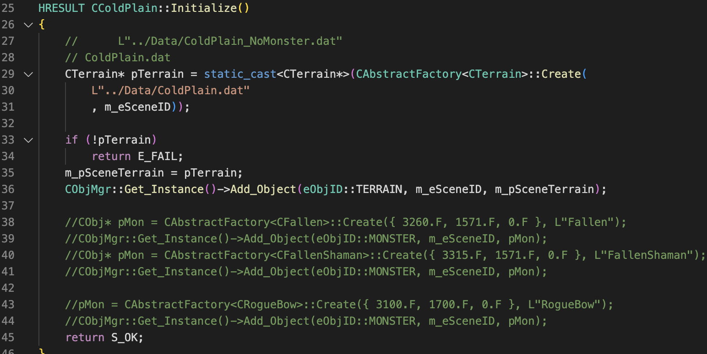
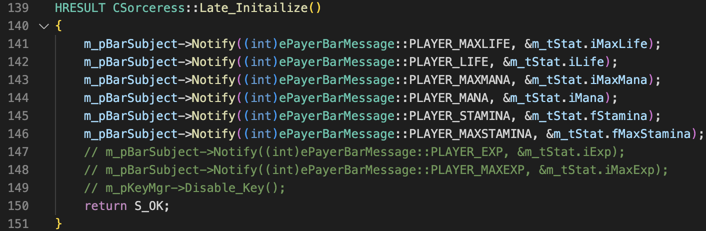

# Clean Code Study - Week2
#### 2023-01-13. Fri. written by HT.LEE
- - -

## Ch3. Functions
+ 소개
    - 함수는 모든 프로그램의 기본 단위이다.

+  참고 - Calling Convention
    - </img> 
    - int swap(int *a, int *b); int swap(int a, int b);
    - <a href="https://stackoverflow.com/questions/2393906/java-method-to-swap-primitives"> Java에서의 swap method </a>

+ 3-1, 3-2, 3-3 비교

+ Small!
    - 최대한 짧게 짜라.
    - 블록과 인덴팅 -> 중첩구조를 줄여라.

+ Do One Thing
    - 함수는 한가지일만 해야한다.
    - 그 한가지 일을 이상 없이 잘해야 한다.

+ One Level of Abstraction per Function
    - <b>한 함수 내에 추상화 수준은 한 종류여야함.</b>

+ Switch Statements
    - <b> switch 분기는 분기 종류를 밑도 끝도 없이 늘릴 수 있다.</b>
    - if else
        * 0 ~99 -> 2가지 
        * 50 크냐/ 작냐/ 25 크냐 작냐
    - Sorceress.cpp line 760
    - 저자: 추상팩토리로 다형적 객체(polymorphic objects)를 생성할 때 제외하고는 switch case 가급적이면 쓰지마라.case 새로 늘어남에 따라 수정해야한다.

+ Use Descriptive Names 
    - 이 룰은 Ch2, Ch4 와도 연계됨.
    - testableHtml -> SetupTeardownIncluder.render
    - <i><b>The smaller and more focused a function is, the easier it is to choose a descriptive name.</b></i>

+ Function Arguments
    - niladic, monadic, dyadic, triadic
    - 무항 > 단항 > 이항 > 삼항
    - 4개 이상? 리팩토링 고려 대상
        * <a href="http://egloos.zum.com/rousalome/v/10029894"> Arm프로세서 함수 인자 개수는 4개로 제한   </a>
    - Flag arguments => "<i>나 두 개이상 일하고 있어요.</i>" 광고하는 셈.
    - 항을 최소화하고 함수 호출을 하다보면 sub-functions들의 연쇄가 많아진다.
    - SDK, 라이브러리 의존적인 개발하면 인자 개수 줄이는 게 쉽지가 않다.

+ Have No Side Effects
    - 3-6 코드의 문제가 무엇인가?
    - Output arguments
        * <a href= "https://learn.microsoft.com/en-us/previous-versions/visualstudio/visual-studio-2012/hh916382(v=vs.110)"> Microsoft SAL annotation </a>

+ Command Query Separation
    - 무언가를 실행할 연산과 답을 얻기 위한 연산을 분리할 것
    - </img>   
    - 구조적 프로그래밍
        원서: <a href="https://dl.acm.org/doi/pdf/10.5555/1243380"> 『Structured programming』 </a>

+ How Do You Write Functions Like This?
+ 결론
    - 클래스는 명사고, 함수는 동사이다. 이 관점으로 이야기를 서술하듯이 코딩할 것.
    - 함수는 
        * 짧아져야하고, 
        * 좋은 이름을 가져야하고, 
        * 잘 조직화되어야하고, 
        * 단 하나의 추상구조를 가져야하며, 
        * 한 가지일만을 잘해야한다.

- - -
## Ch4. Comments
+ 소개
    - "나쁜 코드에 주석 달지 마라. <i> -재작성해라</i>"     - Brian W. Kerninghan and P.J.Plaugher
    - 한줄 요약: 코드가 깔끔하면 주석이 최소화된다.

+ Comments Do Not Make Up for Bad Code.
    - if (employee.isEligibleForFullBenefits())

+ 코드 내에서 스스로 설명할 수 있어야 한다!
+ 좋은 주석
    - 좋은 정보를 담고 있는 주석
    - 의도가 잘 드러나는 주석
    - 명료화(Clarification)
    - 적절한 경고
    - TODO 주석
    - 강조 (Amplification)

+ 나쁜 주석
    - Mumbling (중얼중얼거리는)
    - </img>   

    - <b>중복 주석</b>
        * 4-1. waitForClose
            + (todo : 내용 채울것) 
        * 4-2. Tomcat 코드
            + (todo : 내용 채울것)

    - 오도하는 주석
    - 의무적으로 다는 주석
    - 수필인 주석(Journal Comments)
    - <b>Noise Comments</b>
        * startSending 4-4 vs 4-5 비교

    - Scary Noise
    - </img> 

    - 함수나 변수를 쓸 수 있을 때에는 주석을 달지 마라.
    - Position Markers (섹션 나누기)
    - </img> 
    - Closing Brace Comments
        + (todo : 내용 채울 것)
    - Attributions and Bylines
        + (todo : 내용 채울 것)
    - 코드를 주석으로 만들기
    - </img> 
    - </img> 
    - </img> 
    - HTML
        + (todo : 내용 채울 것)
    - Nonlocal Information
    - Too Much Information
    - 명료하지 못한 연결

- - -
* 심화 학습