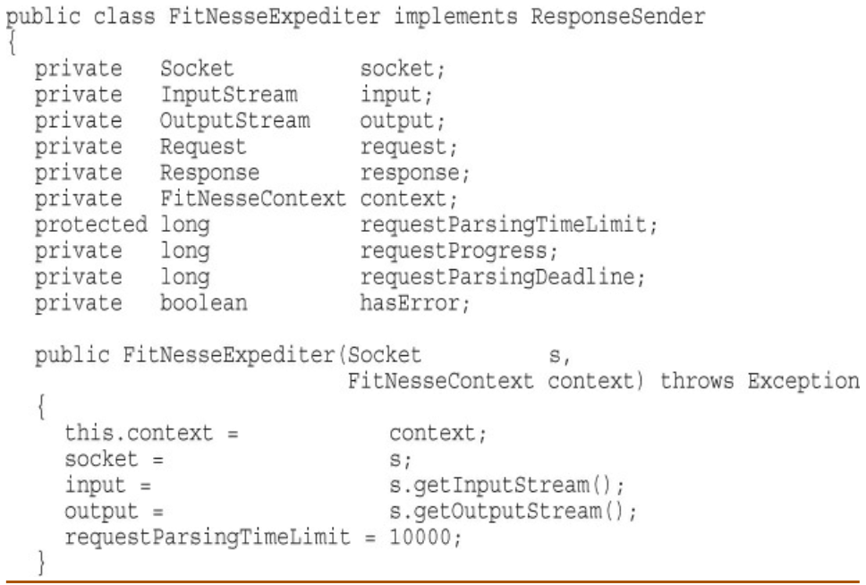

# Clean Code Study - Week3
#### 2023-01-27. Fri. written by HT.LEE
- - -

## Ch5. Formatting
* 포맷팅의 목적     
    + 너무 중요하기 때문에 무시되어서도/맹신해서도 안된다.
    + 효과적인 포매팅은 의사소통을 효율적으로 해주기 때문임.
    + 코딩 스타일과 가독성은 원래 코드가 많이 바뀐 후에도 유지보수성과 확장성에 계속 영향을 끼친다.
    + 코딩스타일, 규율은 계속 지속됨.

* 수직 포매팅   
    + 한 파일당 라인 수
        - FitNesse project 평균 라인수 : 65
        - FitNesse project 1/3의 파일 : 40 ~ 100
    + 파일의 라인 상한선을 설정해라 : ex., 500
    + 신문기사 은유 (두괄식)
        - 추상수준을 기억해라 (고 -> 저)
    + 개념 사이의 수직 개방성 (Listing 5-1, 5-2)
        - 개행 넣을 곳과 넣지 말아야할 곳을 구분해라
    + 수직 조밀성
        - 개념적으로 높은 연관도를 가지는 것끼리는 개행 구분 넣지 마라
    + 수직 거리
        - Concepts that are closely related should be keep vertically close
        to each other.
        - 변수 선언 : 사용처와 가깝게 선언되어야 함.
        - 멤버 변수
            * Scissors rule : public을 상단에, private을 하단에
        - Dependent Functions.
            * caller와 callee와는 붙어있어야함.
            * caller가 callee 위에 (C/C++ 스타일은 아님)
        - Conceptual Affinity.
            * caller/callee 관계 아니더라도 개념이 비슷한 함수들
    + 수직 순서(Vertical Ordering)
        - 읽을 때 (고->저) 순서가 되도록 만들면 좋다.
        - 이것은 우리가 세부사항을 보지 않고도, 시스템의 기능의 요지를 쉽게
        파악하게 해줌

* 수평 포매팅   
    + 한 라인의 길이
        - 80 characters, 100? 120?
        - [왜 80자가 코드 폭의 상한선?] : 
https://softwareengineering.stackexchange.com/questions/148677/why-is-80-characters-the-standard-limit-for-code-width
    + 수평 개방성과 조밀성
        - 함수 시그니쳐의 매개변수 타입과 '('는 붙인다.
        - = 는 띄운다.
        - '+', '-(뺄셈)' '/'  -> 띄운다.
        - '-(부호)', '*' -> 붙인다.
    + 수평 정렬
        - </img><br/>
        - 추천하지 않는 이유: 변수명만 읽고, 타입을 읽지 않게 될 가능성이 높아진다.
    + 인덴트 (Indentation)
        - 가독성을 위해 블록 수준을 달리 해라.(Hierarchy level)
        - 인덴트 파괴 (Breaking Indentation)
            * 아주 짧은 if, while, 함수라 할지라도 인덴트 파괴하지 마라.
    + 더미 스코프 (Dummy Scopes)
        - 따로 개행과 인덴트를 줘서 semicolon이 보이게끔 해라.
        ```
        while (dis.read(buf, 0, readBufferSize) != 1)
            ;
        ```

* 팀 규칙   
    + 팀원들은 단일 포매팅 원칙에 동의해야함.
    + 일관성 - 마치 한 사람이 프로젝트를 만든 것처럼 포맷을 유지해라.

* Uncle Bob's Formatting Rules
    + Listing 5-6 CodeAnalyzer.java (생략)
- - -
## Ch6. Objects and Data Structures
* 데이터 추상화
    + OOP의 5대 특징
        - 추상화
        - 정보은닉
        - 캡슐화
        - 상속
        - 다형성
    + 사견 - "추상화"가 가장 중요한 원칙이라고 봄. 그리고 나머지 4개는 "추상화"를 달성하기 위한 방법들임. 
    복잡한 세부 명세 구현을 직접 살펴보지 않고 추상화된 고수준 인터페이스만 알아도 코드를 (재)사용할 수 있어야함.
    + Access Modifier(접근지정자)
        - C++ : private/protected/public
        - Java : private/default/protected/public
        - Python : 기본적으로 싹다 public인데 _(underscore) 써서 private 할 수 있음.
    + 단순하게 모든 private 멤버변수 getter, setter 만들어주는 것만큼
    어리석은 것도 없다.
        - 멤버변수를 노출시키지 말고, 추상화된 인터페이스를 노출시켜야함.
    + <b>Hiding implementation is about abstractions</b>!
        - 메소드는 프로그래머가 객체가 다른 객체(또는 자기자신)와 어떻게
        의사소통할지에 대한 의도를 잘 드러내야 함.
        - 프로그래머는 노출된 인터페이스를 통해서, 구현 상세에 대한 이해 없이도 데이터의 에센스를 조작할 수 있다.
    
* Data/Object Anti-Symmetry(반대칭)
    + Procedural code (data structure)
        - 기존의 structures를 변경하지 않고 새 함수를 만드는 것이 용이함.
        - 모든 함수를 수정해야하기 때문에 새 structures를 추가하는 것이 어려움.
        - C의 structure 생각하면 됨. (메소드 개념이 없음)
    + OOP (object)
        - 기존의 함수를 변경하지 않고 새 클래스를 만드는 것이 용이함. 
        - 모든 클래스(특히 상속관계에 있는)를 변경해야하기 때문에, 새 함수 추가가 비교적 어려움.
    + 모든 것이 Objects여야 한다는 것은 미신이다.
        - (단순) data structures를 사용하는 것이 적합할 수 있다는 것을 기억해라.

* The Law of Demeter
    + Loose Coupling과 관련된 법칙?
    + [데메테르의 법칙] : https://en.wikipedia.org/wiki/Law_of_Demeter
    + 한 클래스 C의 메소드 f는 오직 아래의 것들만 호출할 수 있다.
        - C의 메소드
        - f에서 생성된 오브젝트의 메소드
            * e.g., f의 로컬
        - f로 넘겨진 인자 오브젝트의 메소드
            * f(a, b)
        - C의 멤버변수가 가지고 있는 오브젝트의 메소드
            * e.g., C의 컨테이너 인스턴스의 원소 오브젝트
    + Train Wrecks
        - 아래의 코드는 sloppy함. 지양해야할 스타일이다.
        ```Java
        final String outputDir = 
        ctxt.getOptions().getScratchDir().getAbsolutePath();
        ```

        ```Java
        Options opts = ctxt.getOptions();
        File scratchDir = opts.getScratchDir();
        final String outputDir = scratchDir.getAbsolutePath();
        ``` 
            위 코드가 The Law of Demeter 어기는지 여부는
            ctxt, opts, scratchDir가 object냐 data structure냐에 따라 다름.
    + Hybrids (structure와 class의 혼종): 하지마라!
    + Hiding Structure
        - 전략 1
        ```Java
        ctxt.getAbsolutePathOfScratchDirectoryOption();
        ```
        - 전략 2
        ```Java
        ctxt.getScratchDirectoryOption().getAbsolutePath();
        ```
        - 전략1 : 메소드 하나가 하나가 하는 일이 너무 많다.
        - 전략2 : getScratchDirectoryOption()은 option을 리턴하는데,
        이것은 개념적으로 object라기보다는 data structure에 가깝다.
        (그냥 옵션일 뿐임)

        - ctxt가 만약 object라면,
        <b> 우리는 그것의 내부를 알기 위해 묻지 말고 그것이 무슨 일을 하라고 시켜야 한다. </b>
        - 대안: 
        ```Java
        BufferedOutputStream bos = ctxt.createScratchFileStream(classFileName);
        ````

* Data Transfer Objects(DTO)
    + 모든 멤버가 public이고 function은 없는 object
        - Kotlin의 Data Class
    + 순전히 <b>통신</b>을 위해서 사용하는 오브젝트
    + DTO는 소켓 통신에서의 메시지 파싱이나, 데이터베이스와 연결할 때 유용함.
    + Listing 6-7 address.java
        - 이 코드는 quasi-encapsulation하다고 볼 수 있음.
    + Active Records
        - 저자는 Active Records에 메서드 넣는 것을 굉장히 부정적으로 본다(혼종임).
    
* Conclusion
    + Objects는 동작(메소드)을 노출시키고 데이터를 숨겨야 한다.
        - 구현이 아니라, 인터페이스를 노출시켜라!
    + Data structures는 데이터를 노출하고, 어떠한 동작(메소드)도 없다.
    + 좋은 소프트웨어 개발자는 이 두 가지를 적재적소에 잘 사용하는 개발자이다!

- - -
* 심화 학습
    Active Record Pattern
* 질문 리스트
    + "bean" form, "bean-accessed"가 무슨 뜻인가?