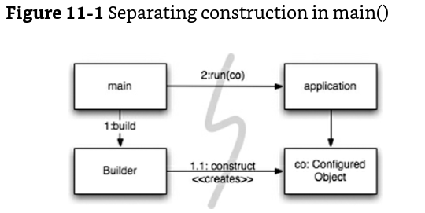
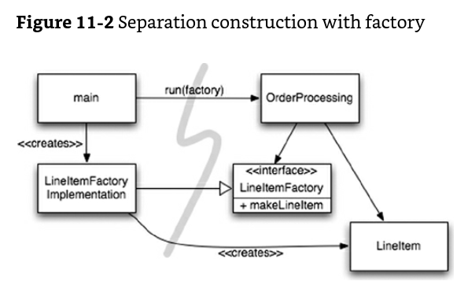
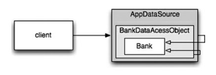

# Clean Code Study
#### 2023-07-29. Sat. written by HT.LEE
- - -
## Ch11. Systems

## 소개 (How Would You Build a City?)
> 복잡성은 죽음이다. 개발자에게서 생기를 앗아가며, 제품을 계획하고 제작하고 테스트하기 어렵게 만든다.   
> 
> Ray Ozzie, Chief Software Architect, Microsoft Corporation.

하나의 도시를 한 사람이 모든것을 관리하도록 맡기는 것은 too much이다.
도시에는 상하수도, 전력, 교통, 법체계 등 관리해야 할 세부 영역들이 있고, 각 영역마다 책임지는 팀이 있기 때문에 도시가 돌아간다.
도시는 적절한 수준의 <b>추상화</b>와 <b>모듈화</b>가 되어 있기 때문에 "관리"될 수 있는 것이다. 
소프트웨어도 마찬가지다.   
이 챕터에서 우리는 시스템 단계에서도 어떻게 코드를 "clean하게" 유지할 수 있을 지 배울 것이다.   

<!-- 이번 챕터에서 배울 내용
1.
2.
3.ㅁ -->
## Seperate Constructing a System from Using It
생성(Construction)과 사용(Usage)는 다른 프로세스라는 것을 기억해야 한다.
비유 - 호텔을 건설하는 일과, 만들어진 호텔을 사용하는 것은 전혀 별개의 이야기   

**소프트웨어 시스템은 반드시 준비 과정과 런타임 로직을 구분해야만 한다.**
- 준비 과정 : 객체가 생성되고 의존성이 서로 연결되는 과정
- 런타임 로직: 스타트업이 끝난 이후 실행되는 과정
특히, 우리는 이번 챕터에서 **관심사 분리(Separation of concerns)**라는 소프트웨어 디자인 기법 중 가장 오래되고 중요한 기법을 배운다.
먼저, 준비 과정과 런타임이라는 두 관심사를 어떻게 구분하는 지 알아보자.
```Java
public Service getService() {
    if (service == null)
        service = new MyServiceImpl(...);
    return service;
}
```
이 기법을 **Lazy Initiailization/Evaluation** 라고 부른다. 이 기법은 아래와 같은 장단점이 있다.
* 장점
    + `null` 포인터 반환이 없다.
    + 객체를 실제로 사용하기 전에는 생성으로 인한 부하를 유발하지 않는다.
* 단점   
    + `MyServiceImpl`의 구현(생성자)에 의존한다. 이러한 의존성을 제거하지 않으면 컴파일조차 할 수 없다.
    + 테스팅이 어렵다.
        - `MyServiceImpl`이 무거운 객체라면 테스트를 위한 Test Double/Mock object를 service 필드에 할당해야 한다.
        - 준비과정 로직과 런타임 로직이 섞여있기 때문에, 모든 실행 경로를 테스트 해야만 한다.
        - 다시 말해, `getService`는 책임이 두 개이며 **Single Responsibility Principle**을 위반하고 있다.
    + 모든 경우에서 `MyServiceImpl`이 적절한 객체인지 알 수 없다. 우리가 "적절한" 객체가 무엇인지 정말로 알 수 있는건가?

따라서, 의존성이 제거되고 강건한 코드가 되기 위한 전략이 필요하다.
### `main`을 분리
생성과 사용을 분리하는 가장 간단한 방법은 모든 생성과 관련된 코드를 `main`에 두는 것이다.  
생성과 관련된 코드는 모두 `main`에 있고, 시스템의 나머지 부분은 적절하게 생성 및 연결되어 있다고 가정하자.   
</img><br>
main은 시스템이 필요로하는 객체를 생성하고 애플리케이션에 넘긴다. 애플리케이션은 그저 사용만 한다(생성 과정을 알지 못한다).

### 팩토리
객체 생성 시기를 애플리케이션이 직접 결정해야할 때도 있다. 이럴 경우, main에서 객체를 만들어서 전해주지 말고, 추상 팩토리를 사용하자.   
</img><br>
주문 처리 시스템에서 애플리케이션이 주문을 추가할 때 `LineItem`을 만들어야만 한다. 이 경우, 추상 팩토리 패턴(Abstract Factory pattern)을 써서 애플리케이션이 `LineItem`을 만드는 시점에 대한 제어권을 가지도록 할 수 있다. 여전히 생성과 사용은 분리되고 있음을 주목하라. 모든 의존성은 `main`에서부터 `OrderProcessing`으로 흐른다. 이것은 애플리케이션의 인터페이스와 실제 `LineItem`을 생성하는 세부 구현이 분리되어있음을 의미한다. 생성의 세부는 `LineItemFactoryImplementation`에서 책임지는데, 이는 여전히 `main`의 파트에 있다. 그러나 객체의 생성 시점과 특정 생성자 인자에 대해서는 애플리케이션 단에서 결정한다.

### 의존성 주입
생성과 사용을 분리하는 또다른 강력한 도구로는 **의존성 주입(Dependency Injection, DI)**이 있다. 이는 **제어 역전(Inversion of Control, IoC)** 기법을 의존성 관리에 적용한 메커니즘을 의미한다. 제어 역전에서는 한 객체가 가지는 보조적 책임을 그것만을 수행할 다른 객체들에게 위임한다. 따라서 이 기법은 SRP를 지원한다.   

객체는 그 자신의 의존성을 직접 실현해서는 안되고 그 책임을 다른 "authoritative" 메커니즘에게 전가해야한다.

```Java
    MyService myService = (MyService)(jndiContext.lookup(“NameOfMyService”));
```
이 코드는 호출하는 쪽에서는 실제로 `lookup` 메서드가 실제로 어떤 객체를 리턴하는 지에 대해 전혀 관여하지 않으면서, 의존성을 해결하고 있다.
Java에서는 Spring 프레임워크가 DI 컨테이너를 제공하는 것으로 유명하다. XML config 파일을 통해서 어느 객체가 서로 연결될 지를 결정하고, Java 코드에서 이름으로 특정 객체를 요청한다. 의존성 주입은 Lazy Initialization의 장점을 공유한다. 대다수의 DI 컨테이너는 팩토리를 호출하거나 프록시를 생성하는 메커니즘을 가진다.

## Scaling Up
***Roma die uno non aedificata est<br>로마는 하루 아침에 이루어지지 않았다.***   
작은 군락이 마을로, 마을에서 도시로 점점 성장할 것이다. 그러나 대도시가 될 것이라고 처음부터 6차선 도로부터 닦으면서 도시를 만들진 않을 것이다.   

**처음부터 "right"한 시스템을 만든다는 것은 미신임을 기억해라.**
Right한 시스템을 위해서 접근할 수 있는 두 방법이 있다.   
먼저 코드 레벨에서의 관점이다. 오늘의 스토리를 구현하고, 내일 맞추어 개발하고 리팩토링하고 확장한다. 반복적으로 점진적으로 애자일 방법론을 밟는다. TDD, 리팩토링, 클린 코드를 수행하여 확장을 가능하게 한다.   

시스템 레벨 관점에서는 어떻게 해야할까? 시스템 관점에서는 simple -> complex로 점진적으로 발전하는 방법은 무엇일까?   
***소프트웨어 시스템은 우리가 관심사를 적절하게 분리해야만 성장/발전할 수 있다.***

`EJB1`, `EJB2` 아키텍처는 관심사 분리를 제대로 하지 않았을 경우 발생하는 문제를 보여주는 예시이다.
(예시 코드 생략)

1. 비즈니스 로직이 EJB2 컨테이너에 강하게 결합되어 있다. 반드시 하위클래스 컨테이너 타입을 만ㄷ르어야하고 그 컨테이너가 필요하는 생애주기 메서드들을 제공해야만 한다.
2. 이 무거운 결합이 고립된 단위테스트를 어렵게 한다. 테스트를 위해 mock 객체를 만들어야만 하는데, 이는 어렵거나 시간 소모적이다. EJB2 아키텍처가 아닌 곳에서는 실제로 재사용하기도 힘들다.
3. OOP 개념이 무시되고 있다. bean은 또 다른 bean으로부터 상속도 불가능하며 중복을 유발하는 불필요한 DTO를 작성해야만 한다.

### Cross-Cutting Concerns(횡단 관심사)
EJB2 아키텍처는 일부 영역에서는 관심사를 잘 분리했다. 트랜잭션, 보안, 영속적 동작(persistence behaviors)은 소스코드가 아닌 DD(Deployment descriptor, web.xml 같은 파일)로 분리했다.   

영속성(Persistence)과 같은 관심사는 도메인의 객체 경계를 넘나든다는 경향이 있다는 점을 기억해라. 따라서 모든 객체가 전반적으로 같은 전략을 사용하도록 고수하는 것이 좋다. 예를 들어, 일반 파일보다는 특정 DBMS를 사용한다거나, 테이블과 열을 위해 네이밍 컨벤션을 따른다거나, 일관적인 트랜잭션 시맨틱을 사용하는 것 등이다.

실제로는 많은 객체에 영속성 전략을 구현하는 동일한 코드를 분산시켜야 한다. 이와 같은 문제를 횡단 관심사(Cross-Cutting Concerns)라고 부른다. 영속성 프레임워크, 도메인 로직을 별도의 모듈화 하겠다는 의미이다. 

횡단 관심사의 모듈성을 확보하는 것을 목적으로 하는 접근법을 Aspect-oriented Programming(AOP)라고 부른다. AOP에서 Aspects는 "특정 관심사를 지원하려면 시스템에서 특정 지점들이 동작하는 방식을 일관성있게 바꿔야한다."라고 명시한다. 이러한 명시는 간결한 선언이나 프로그래밍 메커니즘으로 행해진다. 영속성을 예를 들어, 어떤 객체와 속성을 영속해야하는지 선언한 다음 영속성 프레임워크에 작업을 위임한다. AOP 프레임워크는 대상 코드에 대한 동작 수정을 <i>noninvasively</i> 수행한다. 자바 코드의 사례를 살펴보자.

noninvasively : 대상 소스 코드에 직접적 수정을 가하지 않고 (영향을 미치지 않고?)
## Java Proxies
Java 프록시는 단순한 상황에 적합하다.

Listing 11-3 JDK Proxy Example   
```Java
// Bank.java(suppressing package names ...)
import java.utils.*;

// The abstraction of a bank.
public interface Bank {
    Collection<Account> getAccounts();
    void setAccounts(Collection<Account> accounts);
}
```

```Java
// BankImpl.java
import java.utils.*;

// The "Plain Old Java Object(POJO)" implementing the abstraction.
public class BankImpl implements Bank {
    private List<Account> accounts;

    public Collection<Account> getAccounts() {
        return accounts;
    }

    public void setAccounts(Collection<Account> accounts) {
        this.accounts = new ArrayList<Account>();
        for (Account account: accounts){
            this.accounts.add(account);
        }
    }
}
```

```Java
// BankProxyHandler.java
import java.lanb.reflect.*;
import java.utils.*;

public class BankProxyHandler implements InvocationHandler {
    private Bank bank;

    public BankHandler(Bank bank) {
        this.bank = bank;
    }   

    // Method defined in InvocationHandler
    public Object invoke(Object proxy, Method method, Object[] args) 
        throws Throwable {
        String methodName = method.getName();
        if (methodName.equals("getAccounts")) {
            bank.setAccounts(getAccountsFromDatabase());
            return bank.getAccounts();
        }
        else if (methodName.equals("setAccounts")) {
            bank.setAccounts((Collection<Account>)args[0]);
            setAccountsToDatabase(bank.getAccounts());
            return null;
        }
        else {
            ...
        }

    }

    protected Collection<Account> getAccountsFromDatabase() { ... }
    protected void setAccountsToDatabase(Collection<Account> accounts) { ... }
}
```

```Java
// Somewhere else...

Bank bank = (Bank)Proxy.newProxyInstance(
    Bank.class.getClassLoader(),
    new Class[] {Bank.class},
    new BankProxyHandler(new BankImple()));
```
우리는 프록시에 wrap 되는 Bank 인터페이스를 정의했고, 비즈니스 로직을 구현하는 BankImpl이라는 Plain-Old Java Object(POJO)를 정의했다.

프록시 API는 모든 Bank 메소드의 구현을 프록시로 만들어 호출하는 InvocationHandler 객체를 필요로 한다. BankProxyHandler는 Java reflection API를 사용하여 제네릭 메소드 호출을 BankImpl에서 대응되는 메서드에 매핑한다.

프록시의 단점:
- 클린 코드하기가 너무 어렵다.
- 진정한 AOP 솔루션을 위해 필요로 하는 시스템 전체 실행 포인트를 지정하는 메커니즘을 제공하지 못한다.

## Pure Java AOP Frameworks
Listing 11-4 Spring 2.X configuration file
```xml
<beans>
...
<bean id="appDataSource"
class="org.apache.commons.dbcp.BasicDataSource"
destroy-method="close"
p:driverClassName="com.mysql.jdbc.Driver"
p:url="jdbc:mysql://localhost:3306/mydb"
p:username="me"/>

<bean id="bankDataAccessObject"
class="com.example.banking.persistence.BankDataAccessObject"
p:dataSource-ref="appDataSource"/>

<bean id="bank"
class="com.example.banking.model.Bank"
p:dataAccessObject-ref="bankDataAccessObject"/>
...
</beans>    
```
각각의 bean은 바깥을 둘러싸는 "러시아 인형(마트료시카)"의 한 부분과 같다. 클라이언트는 Bank에 접근하고 있다고 생각하지만 실제로는 wrapper인 BankDataSource에 접근하고 있는 것이다. 우리는 트랜잭션, 캐싱, 다른 기능을 위해 또다른 데코레이터도 추가할 수 있다.   
</img>
<br>
<br>

애플리케이션에서, XML 파일에서 명시된 시스템의 최상위 객체에 대한 DI 컨테이너를 요청하려면 아래의 몇몇 라인을 추가하면 된다.
```Java
XmlBeanFactory bf = new XmlBeanFactory(new ClassPathResource("app.xml", getClass()));
Bank bank = (Bank) bf.getBean("bank");
```
스프링 관련 자바코드가 없어졌으므로 애플리케이션은 사실상 스프링과 분리되었다. 즉, 결합도 문제도 해결된 것이다.

```Java
package com.example.banking.model;
import javax.persistence.*;
import java.util.ArrayList;
import java.util.Collection;

@Entity
@Table(name = "BANKS")
public class Bank implements java.io.Serializable {
    @Id @GeneratedValue(strategy=GenerationType.AUTO)
    private int id;
    
    @Embeddable // An object "inlined" in Bank's DB row
    public class Address{
        protected String streetAddr1;
        protected String streetAddr2;
        protected String city;
        protected String state;
        protected String zipCode;
    }
    
    @Embedded
    private Address address;
    
    @OneToMany(
        cascade = CascadeType.ALL,
        fetch=FetchType.EAGER,
        mappedBy="bank"
    )
    private Collection<Account> accounts = new ArrayList<Account>();
    
    public int getId() {
        return id;
    }
    
    public void setId(int id) {
        this.id = id;
    }
    
    public void addAccount(Account account) {
        account.setBank(this);
        accounts.add(account);
    }
    
    public Collection<Account> getAccounts() {
        return accounts;
    }
    
    public void setAccounts(Collection<Account> accounts) {
        this.accounts = accounts
    }
}
```
EJB2 코드와 비교했을 때 매우 간결해졌다. XML과 Java annotation을 사용해 횡단 관심사를 지원한다.

## AspectJ Aspects
AspectJ는 AOP를 실현하기 위한 full-featured tool중 하나이다. 대부분의 경우 Spring AOP와 JBoss AOP만으로 충분하지만 AspectJ는 훨씬 강력한 수준의 AOP를 지원한다. 그러나, 이를 사용하려면 새로운 툴, 언어, 코드를 익혀야 한다. 자세한 내용은 책의 범위를 벗어나니 생략한다.

## Test Drive the System Architecture
Aspect-like 접근법을 통해 관심사를 분리하는 것의 위력에 대해서 아무리 강조해도 지나치지 않다. 코드 수준에서 아키텍처 관심사와 분리된, POJO를 사용한 프로그래밍은 테스트 주도 설계를 쉽게 해준다. 필요할 때 새 기술을 채택함으로써 너의 아키텍쳐를 단순한 것에서 복잡한 것으로 진화시킬 수 있다.
**앞으로 벌어질 모든 사항을 설계하는**(BDUF, Big Design Up Front)식의 접근은 도리어 변경을 어렵게 만든다.

관심사를 효과적으로 구분한다면, 소프트웨어는 극적인 변화 역시 경제적으로 가능하다. '아주 단순하지만 잘 분리된(decoupled)' 아키텍처로 프로젝트를 빠르게 출시한 후, 인프라를 천천히 더 추가하고 규모를 확장하는 방법도 괜찮다는 말이다.

그러나 통제없이 무작정(rudderless) 해선 안된다. 일반적 범위, 목표, 프로젝트 스케듈, 그리고 최종 시스템의 일반적 구조에 대해서 생각해야만 한다. 변화하는 환경에 대응하여 진로를 수정할 수 있는 능력 역시 가지고 있어야만 한다.

다음과 같이 요약할 수 있다.
> 최적의 시스템 아키텍처는 모듈화된 관심사 영역으로 구성된다. 각각은 POJO로 구현된다.   
> 서로 다른 도메인은 최소로 invasive한 Aspects 또는 Aspect-like 도구로 통합된다.   
> 이러한 아키텍처 역시 테스트 주도 기법을 적용할 수 있다.

## Optimize Decision Making   
어떻게 하면 소프트웨어 개발에서 최적의 의사 결정을 할 수 있을까? 결론부터 말하자면, <b>모듈화</b>와 <b>관심사 분리</b>이다.   
한 사람이 시스템의 모든 것을 결정할 수 없다. 따라서 <b>모듈화</b>와 <b>관심사 분리</b>를 통해 관리 영역을 분산하고 의사 결정을 쉽게 만들어라.   
<b>가능한 최대한 결정을 미루는 것이 최적의 결정이 될 수도 있다.</b> 이는 나태나 무책임을 의미하는 것이 아니라, 최적의 정보를 사용할 수 있을때까지 기다리는 것을 의미한다. 조급한 결정은 부족한 지식으로 내린 결정일 수도 있기 때문이다.

> 관심사를 모듈로 분리한 POJO 시스템이 주는 "기민함(Agility)"은 우리로 하여금   
> 1. 적정 시간 내에서 가장 최근 지식을 바탕으로 한 최적의 결정,
> 2. 복잡성이 경감된(=간결한) 결정   
> 을 할 수 있게 한다.

## Use Standards Wisely, When They Add <i>Demonstrable</i> Value   
표준이 되는 코드는 쓸만하다. 그러나 이것을 맹신해서는 안된다. 표준은 그것이 명백한 가치를 보여줄 때에만 사용해라.   
저자는 수많은 팀이 더 경량화되고 직관적인 디자인을 사용할 수 있음에도 불구하고 단지 표준이란 이유로 EJB2 아키텍쳐를 사용하는 것을 본 적 있다.

> 표준을 사용하면 아이디어와 컴포넌트를 쉽게 재사용할 수 있고, 관련 경험의 직원들을 쉽게 모집할 수 있다.   
> 그리고 좋은 아이디어를 캡슐화하기 쉽고, 컴포넌트들을 연결하기 쉽다.   
> 그러나 표준을 제작하는 일은 산업이 기다려줄만큼 빠르지 못하고, 몇몇 표준들은 원래 표준이 제공하려했던 의도성을 잃기도 한다.

## Systems Need Domain-Specific Languages   

> Domain Specific Language(DSL) is a programming language with a higher level of abstraction optimized for a specific class of problems. A DSL uses the concepts and rules from the field or domain.

훌륭한 DSL은 애자일 방법론이 프로젝트 이해당사자와 개발팀 사이의 커뮤니케이션을 증진해주는 것과 마찬가지로 도메인 개념과 그것을 구현하는 코드 사이의 "커뮤니케이션 갭"을 줄여준다. 네가 도메인 전문가가 사용하는 것과 동일한 언어로 도메인 로직을 설계한다면, 도메인 개념을 구현할 때 부정확하게 번역하는 사고가 일어날 일이 줄어들 것이다.

> DSL은 모든 수준의 추상화를 가능케 한다. 그리고 애플리케이션에서의 고수준 정책에서부터 저수준 상세까지의 모든 영역이 POJO들로 표현될 수 있도록 한다.

## Conclusion
시스템은 반드시 "clean"하게 유지되어야 한다. 아키텍쳐가 성장할수록 도메인 로직은 약해지고 기민성이 위협받는다.
도메인 로직이 불분명해지면 버그는 더 찾기 어려워지고 스토리는 구현하기 힘들어진다. 기민성이 타협된다면, 생산성은 줄어들고 TDD의 이점을 잃게 된다.
모든 추상화 단계에서 의도를 명백히 하라. 이를 위해 POJO를 사용하고 Aspect-like mechanisms을 사용하여 관심사를 분리하라.

무엇보다도 시스템을 설계하든, 개별 모듈을 설계하든 ***실제로 돌아가는 가장 단순한 수단***을 사용하는 것을 잊지 마라.
